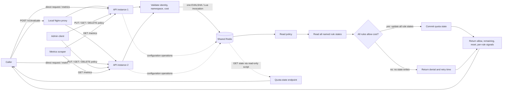

# Architecture and correctness

## Request lifecycle

The API instances keep no quota state in process memory. Policy and quota keys use a hash of the complete `(identifier, namespace)` pair, avoiding raw identifiers in Redis key names and ensuring all state keys for one policy share a Redis Cluster hash slot. `api1` and `api2` in Compose use separate processes and clients but the same Redis service.

## Contention and linearizability

Evaluation calls one Redis Lua script with the policy key. Redis executes a script without interleaving commands from another client. Within that invocation, the service reads the current policy, reads every rule state, computes the decision, and—only when all rules pass—writes every updated rule state. This is the serialization point for evaluations on that Redis primary.

For `N` simultaneous unit-cost requests against a fresh capacity `C`, all requests are ordered by Redis script execution. Exactly `min(N, C)` can consume that rule's tokens/window; later invocations see the committed state and deny. The cross-instance contention test sends 100 concurrent HTTP requests through two independent API servers and requires exactly 17 allows against a capacity of 17. It then inspects state through the other instance.

There is no read/decision/write gap across Redis commands and no local-cache replication lag in this design. The bounded contention is Redis's single-threaded script queue: requests may wait behind the script, but they cannot both observe and spend the same capacity. Runtime policy writes are atomic `SET`s and individual rule deletion is a Lua script. A concurrent evaluation therefore uses the policy value Redis presents at its own script serialization point; it is not guaranteed to use a policy version selected before the request arrived. State keys include rule name, algorithm, capacity, and period, so changing those attributes starts fresh quota state. Recreating a deleted rule with identical attributes can reuse its state until its TTL expires.

Redis scripting is atomic with respect to interleaving, but Redis does not roll back earlier writes if a script fails after a write. The quota script computes and validates the complete decision before issuing writes and then performs a short sequence of known `HSET`/`PEXPIRE` operations. Operational Redis failures, failover, persistence settings, and operator intervention can still affect durability; atomic execution alone is not a durability guarantee.

## Algorithm choices

- **Token bucket** is used for burst shaping. It starts full, refills continuously at `capacity / period_seconds`, and supports short bursts without allowing more than its configured capacity at once.
- **Fixed window** is simple for sustained periodic quotas and produces a precise aligned reset timestamp. It can allow a boundary burst split across adjacent windows; pair it with a token bucket when that behavior is undesirable.
- Multiple named rules compose as an AND: a request is consumed from every rule only when every rule can pay its cost. A rejection consumes from none.

## Policy distribution trade-off

This demo stores policy JSON in Redis alongside the quota state. That keeps the implementation small and makes policy updates immediately visible to all instances, but it couples policy availability and durability to Redis. AOF and a persistent volume help with restart recovery; they do not provide an independent policy source of truth or high availability.

An alternative production architecture is to keep policies in ZooKeeper (or another durable, strongly coordinated configuration store) and have API instances maintain an in-memory policy snapshot. Instances load a snapshot on startup, subscribe to versioned change notifications, and atomically replace their local snapshot when updates arrive. This removes a policy read from the evaluation path and lets existing instances continue with their last known policy during a configuration-store outage.

That alternative introduces its own consistency and lifecycle requirements: instances can briefly enforce different policy versions while an update propagates; watchers must recover after disconnects by fetching a fresh snapshot; new instances must not serve until they have loaded a valid snapshot; deletes and rollbacks need versioned events; and operators need to monitor per-instance policy versions. It does not replace Redis for this design's exact cross-instance quota counters. If Redis is unavailable, instances cannot safely make globally correct quota decisions merely by having policies cached in memory; this service should still fail closed unless a different, explicitly bounded degraded-mode contract is designed.

## Known limits and production follow-up

- The local Compose Redis is one unauthenticated, non-TLS node. It is for a trusted laptop/demo only, not a high-availability production deployment.
- There is no Redis Sentinel/Cluster failover orchestration, backup/restore validation, or defined behavior during Redis outage beyond returning `503` (fail closed).
- Policies are stored in Redis rather than a separate configuration source. For stronger independent policy durability and lower evaluation-path configuration reads, use ZooKeeper or another durable configuration store with versioned watches and instance-local snapshots; account for propagation lag and watcher recovery. This does not remove Redis as the shared quota-state dependency.
- Policy reads/writes and state inspection do not have tenant/admin RBAC beyond a single shared bearer token for configuration. Evaluation/state endpoints assume an authenticated upstream gateway.
- Redis is the single serialization and throughput bottleneck for a hot policy key. A distributed design cannot avoid coordination while preserving exact global quotas; partitioning by policy key distributes distinct tenants, but one tenant's hot key remains serialized.
- `/metrics` counters are process-local and reset on restart. Scrape each instance and aggregate externally; no tenant labels are emitted.
- Redis Lua scripts access derived state keys sharing the policy hash tag. Verify the Redis Cluster version/configuration and script key-access rules before moving this single-Redis Compose deployment to Cluster.
- Idempotency keys, audit history, policy version preconditions, rate-limited administrative operations, authentication for callers, and load/latency benchmarks remain future production work.
