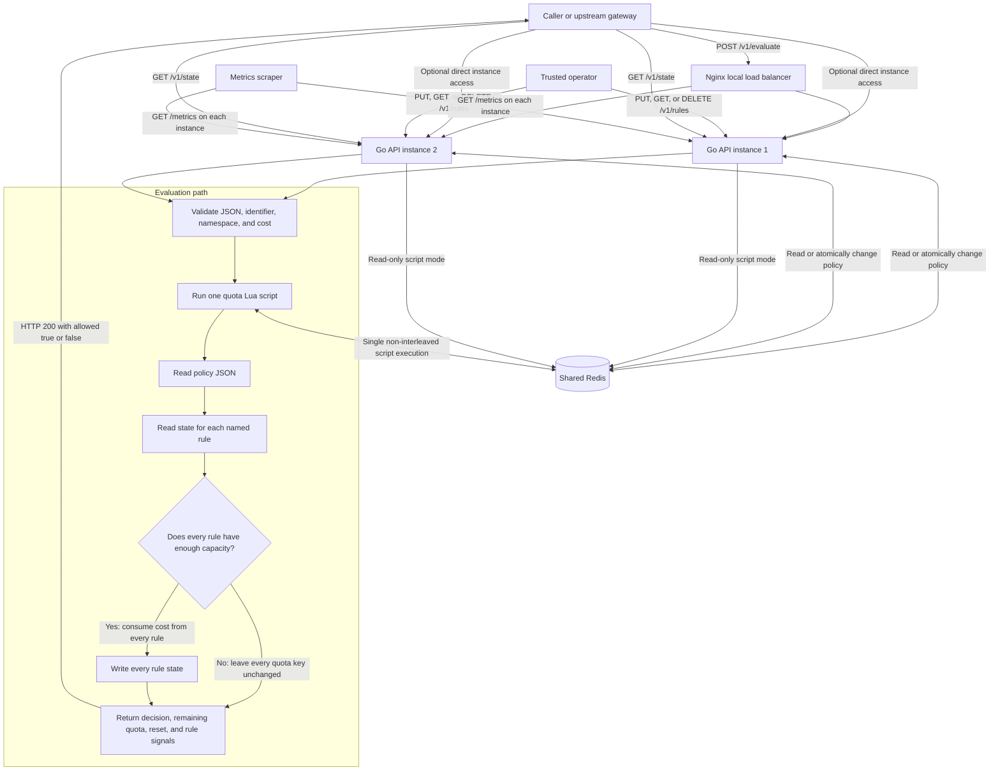

# Architecture and operational behavior

This document describes the service in this repository: a Go HTTP API that stores policy and quota state in Redis, and uses a Redis Lua script to make globally shared quota decisions across API instances. The local Docker Compose stack has two API containers, one Redis container, and an Nginx proxy.

## 1. Components and request flow



Nginx is only part of the local demo. In a deployment without it, a caller or external load balancer can send requests to any API instance. The API instances hold no local quota counters: they all use the same Redis service. The caller's `identifier` and `namespace` select a policy; they are not authenticated by this service, so a real deployment must derive or validate identity at a trusted gateway or add service-side caller authentication.

## 2. One evaluation, step by step

For `POST /v1/evaluate`:

1. The API decodes one JSON object and rejects malformed or unknown fields. It validates that `identifier` and `namespace` are present and within their size limits. `cost` defaults to 1 and must be a positive integer no greater than 1,000,000.
2. The API derives a Redis policy key from the SHA-256 hash of the identifier and namespace. This avoids putting raw identifiers into Redis key names.
3. The API invokes the Lua script through the Redis client. The script reads the current policy and gets the current time from Redis, not from the API host clock.
4. For each configured rule, the script reads that rule's state and computes its current available quota. Rules are constraints combined with AND: all must permit the requested cost.
5. If any rule denies the cost, the script writes no quota-state updates. If every rule permits it, the script updates all rule states before returning the decision.
6. The API returns HTTP 200 for a successfully computed decision, whether allowed or denied. The JSON body includes `allowed`, remaining quota, reset information, the handling instance ID, and per-rule quota signals. A denial includes a retry estimate and `Retry-After` header.

Requests with no configured policy return 404. Invalid requests, including a cost greater than any rule's capacity, return 4xx. Redis/backend failures return 503; the service does not invent an allow decision when it cannot check the shared quota.

The evaluation script handles at most eight rules per policy. Its Redis work is bounded by that configured maximum; it does not make one separate network round trip per rule.

## 3. Algorithms and state

Each rule has a name, algorithm, capacity, and period in seconds.

### Token bucket

- A new bucket starts full, with `capacity` tokens.
- Tokens refill continuously at `capacity / period_seconds` tokens per second, up to the configured capacity.
- A request of cost `c` is allowed when at least `c` tokens are available; the script subtracts `c` on an allowed decision.
- The bucket is stored lazily: its saved value and timestamp are used to calculate refill when a request or state read occurs. A read-only state request does not write the newly calculated value back.
- Token counts can be fractional internally. Reported quota values can therefore contain a small fractional remainder, even when they are close to zero.

### Fixed window

- Time is divided into aligned windows of `period_seconds`.
- Each window tracks its consumed request cost. Its count starts at zero when the script first evaluates that window.
- A request is allowed only when current usage plus its cost is no greater than capacity.
- The reset time is the end of the current aligned window.
- This is simple for periodic quotas, but a caller can use quota near the end of one window and again at the start of the next. Pair it with a token bucket when this boundary burst is unacceptable.

### Several rules together

A policy can combine token-bucket and fixed-window rules. For example, `burst` can allow 20 requests per 10-second refill interval, while `sustained` allows 100 per aligned minute. Both must allow the request. When the request is allowed, its cost is charged against every rule; if one denies it, none of the rules are charged.

The top-level `remaining` field is the smallest remaining capacity across the rules, not a new independent quota. Per-rule fields are the precise values to inspect when diagnosing a decision. For denied decisions, `retry_after_ms` is based on the longest retry estimate among denying rules, because all blocking constraints must clear.

## 4. Redis keys, persistence, and expiry

For `(identifier, namespace)`, the policy key has the form:

```text
ratelimit:{<sha256(identifier + NUL + namespace)>}:policy
```

Quota state is stored separately for each rule:

```text
ratelimit:{<same-hash>}:state:<name>:<algorithm>:<capacity>:<period-ms>
```

The key includes the rule's algorithm and parameters. Changing a rule's name, algorithm, capacity, or period therefore selects a different state key and starts fresh state for that configuration. Old state keys expire eventually; if an identical configuration is recreated before expiry, it may reuse the old state.

Quota-state keys receive a Redis TTL when a successful evaluation writes them. Token-bucket state expires after at least the larger of two refill periods or 60 seconds; fixed-window state expires after two windows. The TTL is cleanup for inactive state, not the quota's reset time. A read-only state request does not extend the TTL. Policy keys do not have a TTL and are removed by the configuration delete API.

The Compose Redis command enables AOF and stores Redis data in a named Docker volume. This helps Redis restore data on container restart while the volume is retained. It is not a backup or a highly available store; Redis's default AOF fsync policy can still lose recent writes in a host/power failure. Removing the volume removes that persisted data.

More precisely, Compose starts Redis with `--appendonly yes` but does not change Redis's default `appendfsync everysec` setting. Redis acknowledges a write before every such write is necessarily fsynced to disk; a machine or power failure can therefore lose roughly the most recent second of acknowledged policy and quota writes (the exact amount depends on timing and failure mode). AOF is not replication, a backup, or a zero-loss guarantee. Production durability requires an explicit recovery-point objective, tested backups/restore, and a persistence/failover configuration appropriate to that objective.

## 5. Redis client connections

Each running API process constructs one `redis.Client` in `main()` and shares that concurrency-safe client across its request handlers. The client maintains a connection pool; requests borrow a connection while sending commands and return it to the pool when finished. The integration test's two API servers each use a separate client, just as two deployed processes do.

This repository does not set pool options explicitly. With the pinned `go-redis/v9` version, the default base pool size is `10 * runtime.GOMAXPROCS(0)` per client. This is a pool sizing target, not a promise that that many TCP connections are opened at startup: connections are created as needed. `MaxActiveConns` is left at its default of zero, which means there is no explicit hard cap; when demand exceeds the base pool size, the library can allocate additional connections. Pool wait duration and active/idle connections therefore depend on runtime CPU settings and traffic. For a production deployment, explicitly size and cap the pool from measured concurrency and Redis capacity, and monitor pool timeouts and connection counts.

## 6. Why concurrent requests do not overspend

`runQuotaScript` submits one Redis Lua script invocation for an evaluation. The script contains several Redis commands (`GET`, `TIME`, `HMGET`, and, for an allowed decision, `HSET`/`PEXPIRE`), but Redis runs the script without interleaving another client's commands in the middle of it. This script execution is the decision's serialization point on the Redis primary.

For a fresh unit-cost quota with capacity 17 and 100 simultaneous requests, Redis orders the 100 script invocations. With the test's slow refill period, the first 17 consume the available quota and later invocations see the updated state and deny. A token bucket can refill while requests queue, so exactly 17 is a property of the test's timing/configuration, not a universal result for every load or refill rate. Two API processes do not create two independent allowances because neither owns a local counter.

The race windows and boundaries are:

- **Between separate client-side read and write commands:** none for the quota decision, because check and update happen in one server-side Lua invocation rather than separate API-issued commands or a `MULTI`/`EXEC` transaction.
- **Between evaluations:** each complete script is serialized on Redis; requests can queue behind one another, especially on a hot key. The configured limit of eight rules bounds the per-script rule loop, not Redis queue length or end-to-end latency.
- **Between a policy update and an evaluation:** `PUT` uses Redis `SET`, and deleting one named rule uses a Lua script. Redis orders each operation relative to the evaluation script. An evaluation sees whichever complete policy value is in Redis at its own serialization point; there is no policy version pinning across requests.
- **After Redis commits but before the client receives the HTTP response:** the response can be lost even though quota was consumed. Retrying can consume quota again; this API currently has no idempotency key or request-deduplication store.
- **During Redis failover, persistence recovery, or a script runtime error:** atomicity prevents interleaving, but does not guarantee durability or rollback after writes. The local setup is a single Redis node and has no failover contract.

The HTTP contention test sends 100 concurrent requests through two independent `httptest` API servers and expects exactly 17 allows. It then reads quota state through the other instance. The test requires a Redis service and is run in GitHub Actions with Redis available. Algorithm tests also cover token refill and an AND policy where denial by one rule must not partially charge another.

## 7. Configuration and state inspection

`PUT /v1/rules?identifier=...&namespace=...` validates and replaces the complete policy JSON in Redis. Configuration calls must include the configured admin bearer token in the `Authorization` header. `GET` reads the policy. `DELETE` with `name=...` removes one rule atomically; without `name`, it deletes the policy.

Configuration is stored in Redis for this demo so all instances see changes immediately without local caches, database reads, or restarts. This couples policy availability/durability to Redis. A production alternative is ZooKeeper or another durable configuration store as policy source of truth, with API instances holding versioned in-memory snapshots and watching for updates. That lowers policy reads on the request path, but requires reliable watch reconnection, snapshot refresh, version tracking, and acceptance/handling of short propagation lag. It does not replace Redis for the exact globally shared quota state used here.

`GET /v1/state?identifier=...&namespace=...` runs the same quota calculations in read-only mode. It reports current consumption, remaining capacity, and reset time without spending quota or extending state TTL. Since other evaluations can run immediately before or after the read, this is a snapshot, not a reservation or guarantee that the returned balance will still be available to the next request.

## 8. Health, metrics, and errors

- `GET /healthz` currently pings Redis as well as handling the request. It returns 200 when Redis is reachable and 503 otherwise. There is no separate process-only liveness endpoint, so this endpoint is best treated as a combined readiness check.
- `GET /metrics` emits Prometheus text-format process-local counters for evaluations, allow/deny decisions, and errors. Each instance must be scraped separately and counters reset on process restart. The endpoint does not use Redis and has no authentication in this demo.
- An allow or deny is a successfully computed evaluation and returns 200. Callers must inspect the `allowed` field. The limiter answers whether the caller may proceed; an upstream application or gateway decides whether to execute the business operation or return HTTP 429 to its caller.
- For each blocking rule, `retry_after_ms` estimates when that rule can accept the requested cost. For a fixed window, it is the time remaining until the aligned window reset. For a token bucket, it is the time needed to refill the missing tokens: `ceil((cost - available_tokens) * period_ms / capacity)`. The top-level `retry_after_ms` is the maximum wait among blocking rules, because the request cannot pass until every blocking rule permits it. The JSON field is omitted when its value is zero (`omitempty`), normally on allowed responses. It is an estimate: the caller is not reserving the quota, and another request may consume it first.
- A 503 means the service could not safely make a quota decision. Treat it as no permission to proceed (fail closed).
- The response includes an instance ID but not a unique request ID. There is no retry deduplication. A lost response after consumption is ambiguous to the caller.

## 9. What this implementation does not claim

The local Compose stack is an interview/demo deployment, not production hardening:

- Redis is a single node with no authentication, TLS, Sentinel/Cluster failover, or tested backup/restore. API replicas can scale horizontally, but this Redis configuration is still a single point of failure and a hot-policy serialization bottleneck.
- `identifier` and `namespace` are accepted from the request. Admin policy writes use one shared bearer token, but evaluation and state inspection are unauthenticated. Put the service behind a trusted identity gateway or implement caller authentication and tenant binding before public exposure.
- There is no idempotency, request ID, per-tenant authorization, policy audit log, policy version precondition, latency histogram, tracing, or benchmark suite.
- Redis Lua guarantees non-interleaving on the current primary, not rollback, cross-failover exactly-once behavior, or lossless durability.
- `GET /healthz` is not split into liveness and readiness probes; metrics are process-local and unauthenticated.
- ZooKeeper-driven policy snapshots are a documented alternative, not implemented in this repository.

See [README.md](./README.md) for setup, API examples, and test commands. The push and pull-request workflow runs the race-enabled tests against a Redis service, static analysis, and a Go build.
